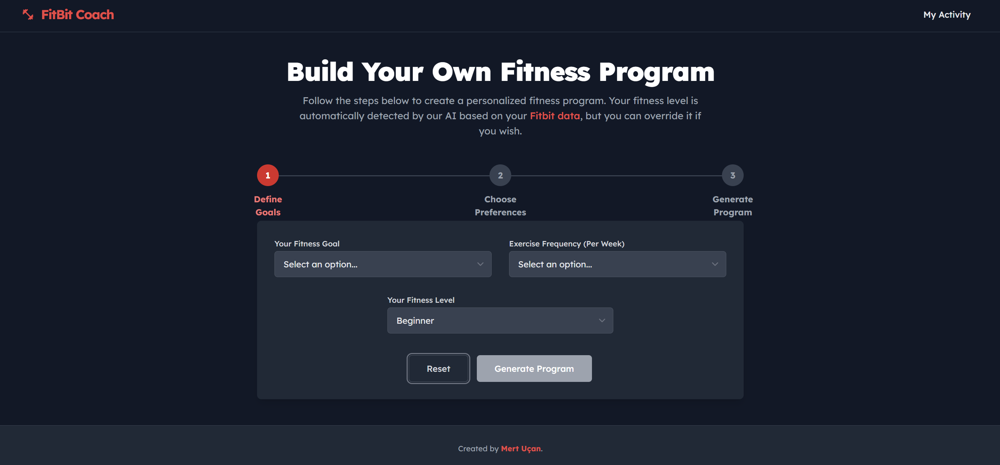
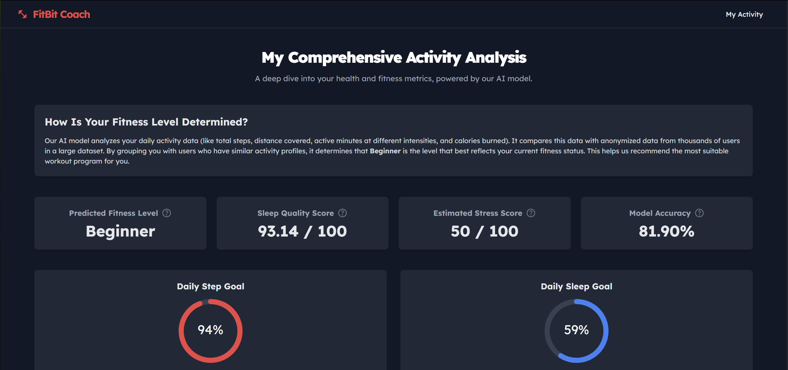

# FitBit Coach: AI-Powered Personal Fitness Koçu

FitBit Coach'a hoş geldiniz! Bu akıllı web uygulaması, kişisel fitness asistanınız olmak üzere tasarlanmıştır. Proje, Fitbit kullanıcı verilerini analiz ederek size özel antrenman programları sunmak, fiziksel aktivitenizi, uyku düzeninizi ve stres seviyenizi derinlemesine incelemek için **hibrit bir yapay zeka yaklaşımı** (makine öğrenmesi ve uzman sistem) kullanır.


## 📸 Ekran Görüntüleri

<table>
  <tr>
    <td align="center"><strong>Ana Sayfa - Program Oluşturucu</strong></td>
    <td align="center"><strong>Aktivite Analiz Sayfası</strong></td>
  </tr>
  <tr>
    <td></td>
    <td></td>
  </tr>
</table>

## ✨ Temel Özellikler

- **Dinamik Aktivite Analizi:** Gerçek Fitbit verileriyle beslenen, makine öğrenmesi destekli kişisel sağlık panosu.
- **Akıllı Seviye Tespiti:** Kullanıcının fitness seviyesini günlük aktivite metriklerine dayanarak otomatik olarak tahmin eden bir **K-Nearest Neighbors (KNN)** modeli.
- **Hibrit Program Üretici:** Hem yapay zekanın tahmin ettiği seviyeyi hem de kullanıcının kendi seçtiği seviyeyi dikkate alan, **güvenliği önceliklendiren** bir uzman sistem.
- **Kapsamlı Sağlık Skorları:** Uyku kalitesi (verimlilik analizi) ve tahmini stres seviyesi (kalp atış hızı değişkenliği analizi) için gelişmiş metrikler.
- **Modern ve İnteraktif Arayüz:** React, Vite ve Tailwind CSS ile oluşturulmuş, Recharts ile zengin veri görselleştirmeleri sunan kullanıcı dostu bir arayüz.

## 🚀 Teknoloji Yığını

-   **Frontend:** React, Vite, Tailwind CSS, Recharts, Axios
-   **Backend:** Flask, Pandas, Scikit-learn, Joblib
-   **Veri Kaynağı:** Kaggle'dan [Fitbit Fitness Tracker Veri Seti](https://www.kaggle.com/datasets/arashnic/fitbit)

## 🤖 Yapay Zeka Mimarisi

Bu proje, son derece kişiselleştirilmiş ve akıllı bir kullanıcı deneyimi sunmak için iki ana yapay zeka bileşenini birleştirir.

### 1. Akıllı Program Üretici (Uzman Sistem)

Uygulamanın kalbi, bir uzman sistem gibi davranan yapay zeka destekli bir antrenman planlayıcısıdır. Statik planlar yerine, haftalık programı aşağıdaki faktörlere göre dinamik olarak oluşturur:

-   **Kullanıcının Fitness Hedefi:** (Kas Kazanımı, Kilo Kaybı, Güç, Genel Sağlık)
-   **Antrenman Sıklığı:** (Haftada 3, 4 veya 5 gün)
-   **Hibrit Seviye Değerlendirmesi (Güvenlik Odaklı):** Bu benzersiz özellik, hem **kullanıcının kendi bildirdiği** (`user_level`) hem de **makine öğrenmesi modelinin tahmin ettiği** (`predicted_level`) fitness seviyesini karşılaştırır. Sanal koç, bu iki seviyeden **daha düşük olanını** baz alarak programın hem etkili hem de güvenli olmasını sağlar.
-   **Dinamik Egzersiz Seçimi:** Sistem, kullanıcının hedefine göre bileşik ve izole hareketlere öncelik veren zengin bir egzersiz veritabanı kullanır ve her antreman gününe otomatik olarak ısınma/soğuma rutinleri ekler.

### 2. Kapsamlı Aktivite Analizi (`My Activity` Sayfası)

Bu sayfa, kullanıcının sağlığı hakkında derinlemesine bilgiler sunan kişisel bir sağlık panosudur.

-   **Fitness Seviyesi Tahmini:**
    -   **Model:** Denetimli bir makine öğrenmesi algoritması olan **K-Nearest Neighbors (KNN) Classifier** kullanılır.
    -   **Süreç:** Model, günlük aktivite metriklerindeki (`TotalSteps`, `TotalDistance`, `VeryActiveMinutes`, `FairlyActiveMinutes`, `LightlyActiveMinutes`, `SedentaryMinutes`, `Calories`) kalıpları tanımak için Fitbit veri seti üzerinde eğitilmiştir. Sayfa ziyaret edildiğinde, rastgele bir kullanıcı verisi modele beslenir ve kullanıcının aktivite profiline göre fitness seviyesi tahmin edilir. Modelin doğruluğu, **5-katlı Çapraz Doğrulama (5-fold Cross-Validation)** yöntemiyle değerlendirilerek güvenilirlik sağlanır.

-   **Uyku Kalitesi Skoru:** Bu skor (0-100), **uyku verimliliğine** (`TotalMinutesAsleep` / `TotalTimeInBed`) dayanarak hesaplanır.
-   **Tahmini Stres Skoru:** Bu skor (0-100), kullanıcının kalp atış hızı verilerinden **Kalp Atış Hızı Değişkenliği (HRV)** analiz edilerek tahmin edilir. Genellikle, daha yüksek değişkenlik daha düşük stres seviyesini gösterir.

## ⚙️ Kurulum ve Çalıştırma

Projeyi yerel makinenizde kurmak ve çalıştırmak için bu adımları izleyin.

### Ön Gereksinimler

-   [Node.js](https://nodejs.org/) (v18 veya üstü önerilir)
-   [Python](https://www.python.org/) (v3.9 veya üstü önerilir) & Pip
-   Bir Kaggle hesabı ve API anahtarı.

### 1. Kaggle API Kurulumu

Gerekli veri setini indirmek için bir Kaggle API anahtarına ihtiyacınız var.

1.  Kaggle hesap ayarlarınıza gidin (`https://www.kaggle.com/<KullanıcıAdınız>/account`).
2.  "Create New API Token"a tıklayın. Bu, bir `kaggle.json` dosyası indirecektir.
3.  Bu dosyayı uygun dizine yerleştirin:
    -   **Windows:** `C:\Users\<KullanıcıAdınız>\.kaggle\`
    -   **macOS/Linux:** `~/.kaggle/`
    *(Eğer `.kaggle` klasörü mevcut değilse oluşturmanız gerekebilir)*.

### 2. Backend Kurulumu

1.  Terminalinizde **projenin kök dizinine** gidin.

2.  **Python bağımlılıklarını yükleyin:**
    ```bash
    pip install -r backend/requirements.txt
    ```

3.  **Veri setini indirin:**
    Bu proje, Kaggle'daki Fitbit veri setini kullanır.
    ```bash
    # Not: PowerShell'de bu komutları tek tek çalıştırmanız gerekebilir.
    kaggle datasets download -d arashnic/fitbit -p data/ --unzip
    ```
    Bu komut, veri setini `/data` klasörüne indirip sıkıştırılmış dosyaları çıkaracaktır.

4.  **Build the AI Model:**
    Sunucuyu başlatmadan önce model oluşturma betiğini çalıştırmalısınız. Bu, verileri analiz edecek, KNN modelini ve ölçekleyiciyi (scaler) eğitecek ve gerekli yapay zeka dosyalarını kaydedecektir.
    ```bash
    python backend/model_builder.py
    ```
    Bu komut, `/backend` içinde bir `ml_artifacts` klasörü oluşturacaktır.

5.  **Flask Sunucusunu Çalıştırın:**
    Backend klasörüne gidin ve uygulamayı çalıştırın.
    ```bash
    cd backend
    python app.py
    ```
    Backend sunucusu şimdi `http://localhost:5000` adresinde çalışıyor olacak.

### 3. Frontend Kurulumu

1.  **Yeni bir terminal açın** ve projenin kök dizinine gidin.

2.  **Frontend klasörüne gidin ve Node.js bağımlılıklarını yükleyin:**
    ```bash
    cd frontend
    npm install
    ```

3.  **Frontend Geliştirme Sunucusunu Çalıştırın:**
    ```bash
    npm run dev
    ```
    React uygulaması şimdi `http://localhost:5173` adresinde çalışıyor olacak.

### 4. Kurulum Tamamlandı!

FitBit Coach'u kullanmaya başlamak için tarayıcınızda `http://localhost:5173` adresini açın.
